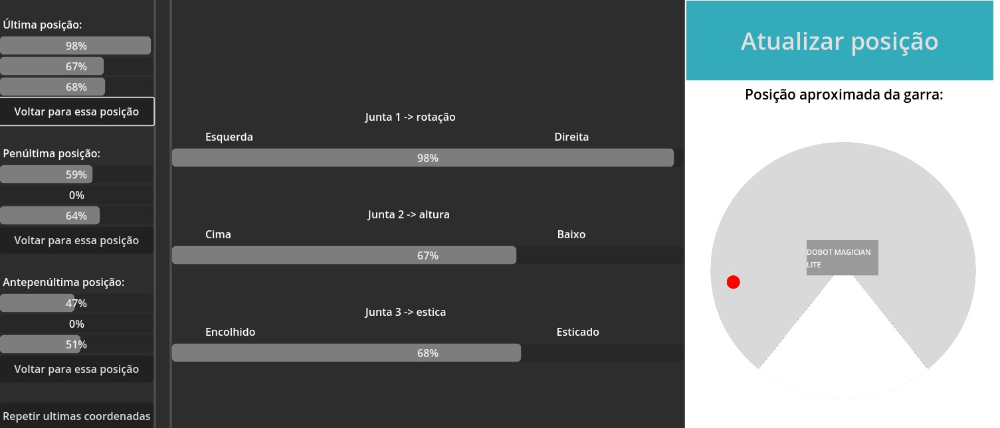

# dobot-controller
Plataforma que permite controlar o Dobot Magician Lite, com um modelo 3D em tempo real

### Conteúdos
- [Vídeo demonstração](#vídeo-demonstração)
- [Descrição da solução](#descrição-da-solução)
- [Executando o projeto](#executando-o-projeto)

## Vídeo demonstração
- v1.0.0 - https://photos.app.goo.gl/du6HN2J5HaDLSP2s7
- atualização v2.0.0 - https://photos.app.goo.gl/oomaRNydcEyQQ2pT8

## Descrição da solução

A solução:
- Mostra a posição aproximada da garra do robô
- Mostra a porcentagem de flexão de cada uma das juntas
- Permite a visualização das ultimas  3 posições do robô
- O usuário pode pedir que o robô retorne para qualquer uma dessas três posições ou executá-las em sequência

A solução é composta de uma API, em flask, um banco de dados SQLite e um frontend, feito na engine Godot.

### Flask
Faz a conexão do frontend com o banco de dados e o Dobot Magician. Faz inserções e querys no banco dados, manipula o robo via SERIAL-usb e troca informações com o frontend por requisições HTTP 
- Utilização do ORM Prisma para manipulação do banco de dados
- PySimpleGUI para criar caixas de dialogo que auxiliam na conexão do robô
- Pydobot para comandar o Magician Lite

### Godot
Mostra as informações para o usuário
- Versão 4.0.1 da engine utilizada
- Formato executável para windows, sem necessidade de conexão com a internet

### SQLite
Armazena todas as posições passadas do robô.
- Manipulado pela ORM Prisma

## Executando o projeto
> Execute os comandos em um terminal na pasta `dobot-controller`

1° - `cd backend`

2° - `python -m venv venv`

3° - `cd venv\Scripts`

4° -  Caso esteja utilizando o PowerShell, rode `.\Activate.ps1`
   -  Caso esteja utilizando o Command Prompt, rode `activate.bat`

5° - `cd ..\..\api`

6° - `pip install -r requirements.txt`

7° - `cd ..`

8° - `prisma generate`

9° - `cd api`

- Agora, conecte o Dobot Magician e ligue-o

10° - `python app.py`

> Você terá que selecionar a porta COM onde o robô está conectado.

### Pronto! agora é só acessar a pasta `executable` e executar a interface!
